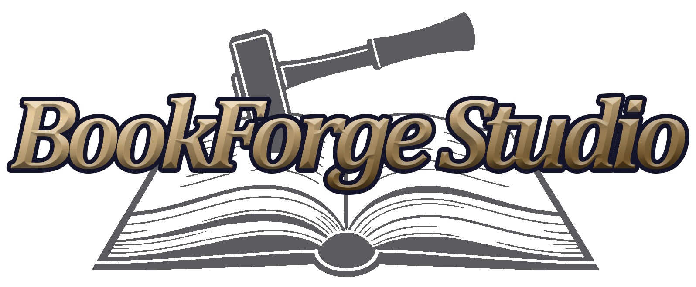
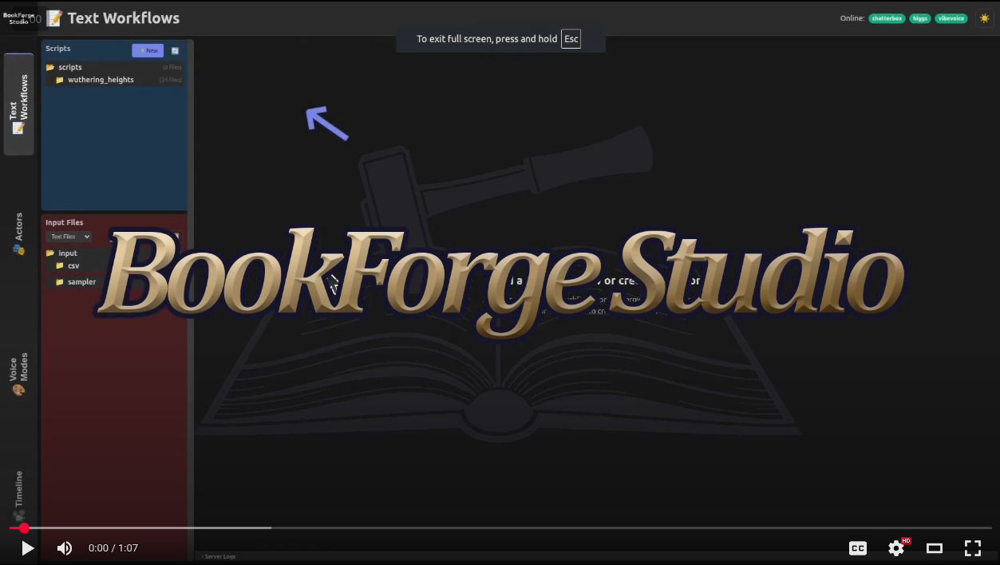
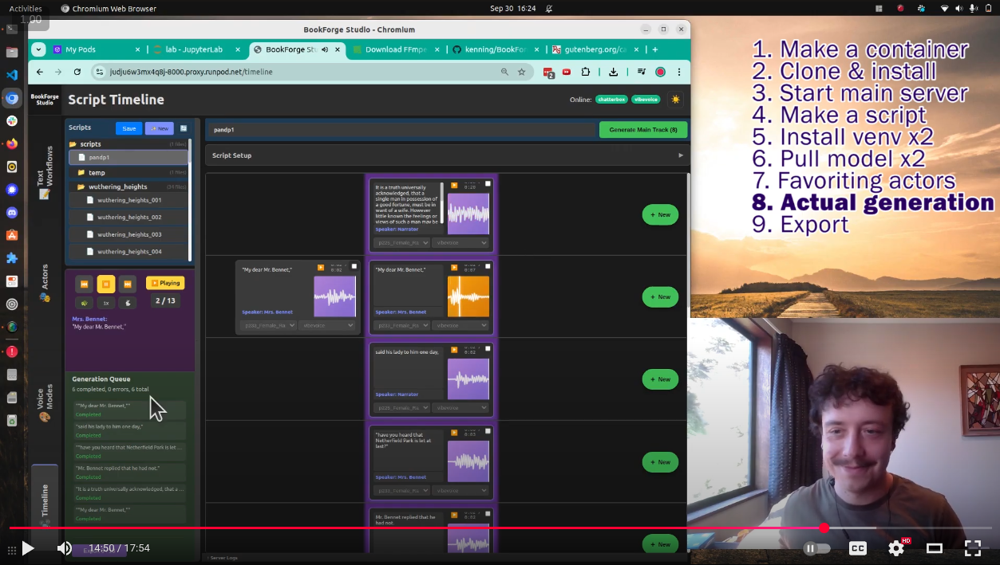

# BookForge Studio

Promo video on Youtube:

## TL;DR Get it set up and running locally

1. Install ffmpeg and python 3.10. (Other python versions are currently untested.)

1. `pip install -r requirements.txt`

1. Windows:
   1. Open command prompt and run `run.bat`, select option 2 "Start main server"
   1. Open **another** command prompt and run `run.bat`, select whichever AI model you want to run.
   1. Go to [localhost:8000](localhost:8000)

1. Unix (Linux/Mac):
   1. Open the terminal and run `make main`
   1. Open **another** terminal and run `make` to see all the possible models you can run. Pick one
   and run it with `make chatterbox-service`, `make higgs-service`, etc.
   1. Go to [localhost:8000](localhost:8000)

* Optional: You can run multiple AI models at once if you wish.

* Optional: You can also run [Ollama](https://ollama.com/) for local speaker identification. 

## Video on how to install and use (Runpod)

## Concepts

* **Local, open source tool.** This repo is MIT licensed and designed for local or hosted usage.

* **Model-agnostic, workflow-specific.** BookForge Studio is designed for **creating fully voiced 
   audiobooks with AI audio models and unique voices for every character.** Different models can be
   swapped out and even run in parallel if you find one model is good for a certain thing. New 
   open source AI audio models will be added as they are released. 

* **Support single-speaker and multi-speaker generation.** Some models like dia only do 
   multi-speaker generation, many models only do single-speaker. Some like higgs do both. We aim
   to support whichever modes are viable, or both for experimentation purposes, with voice clones 
   correctly assigned to each party.

* **Models run on a separate process to the main server.** This means you need to run the main
   server, open another command prompt, and then start a process for the model you want to use.
   Some of these models take tons of VRAM -- higgs specifically is gigantic. Some are smaller like
   chatterbox or VibeVoice-1.5B (small). **Each 'service' command will automatically create a 
   virtual environment just for the model you choose.**

-- 

* **Actors**: An 'actor' is a voice clip + some extra data which can be reused to represent a 
   specific character. You can 'favorite' actors.
* **Voice Modes**: A 'voice mode' is a series of 'steps' which each do one task and can be chained
   together. Start with the default voice modes visible in the interface. You can customize them
   for a specific workflow (i.e. you may want to have separate voice modes for high, medium and low
   cfg scale inference, in case one works better with a specific character or context).
* **BookForge Studio Script**: The fundamental 'project file' for BookForge Studio, this file 
   includes all your work on a chapter of a book, including each line of dialogue, what character
   said it, what actor and voice mode is assigned, and links to all generated audio.
* **Text Workflows**: Various ways to turn text or a CSV into a BFS Script. These can include
   using external api's, a local LLM (hosted with ollama), or simply dragging a pre-annotated CSV.

## Adding files (audio, text, etc.) into your project

Audio files, text files (like an audiobook, a chapter of an audiobook, or CSV files which include 
audiobook text and speakers) should be placed in the `files/input` folder. You can also drag and
drop files in the interface. (Output files will generate in `files/output`.)

**BookForge Studio comes conveniently pre-loaded** with:
* 24+ public domain books (in English) pre-annotated with speakers from the 
   [ANITA](https://huggingface.co/datasets/nick-mccormick/ANITA) dataset
   * One book, Wuthering Heights, has also been turned into a "starter project" to show what a
   basic script looks like. However you can turn any of the ANITA dataset books into a BFS script
   using the "Make Script from CSV" workflow.
* 250+ voice clips pre-assigned to 'actor' files from the 
   [tts-voices-sampler](https://huggingface.co/datasets/nick-mccormick/tts-voices-sampler) 
   dataset.

## For Developers

Check out [README-developers.md](./readme-extras/README-developers.md)

## Licenses

This repo is MIT licensed.

Chatterbox and VibeVoice are MIT. Dia and Higgs are Apache 2.0. 

## Possible future work

If there is interest, our team may provide support for IndexTTS2. However, the emotion control is
a pretty large new feature just for that one model, adoption appears low for now, and 
[the Bilibili license](https://github.com/index-tts/index-tts?tab=License-1-ov-file#readme) is
not exactly full open source.

## Thanks

Thanks to [psdwizzard](https://github.com/psdwizzard) and 
[cursedhelm](https://github.com/EveryOneIsGross) for the help thus far!